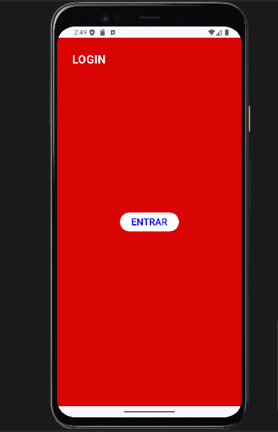
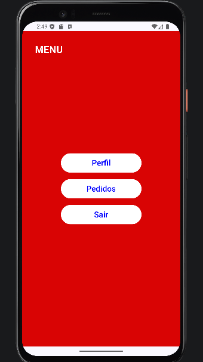
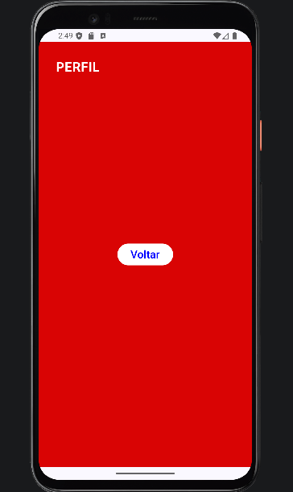
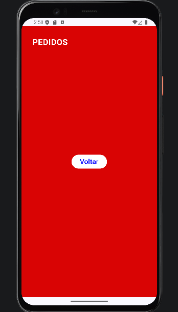

<h2>📱 Telas do Aplicativo</h2>

<table>
<tr>
<td align="center">
<b>Login</b> 

</td>

<td align="center">
<b>Menu</b> 

</td>
</tr>

<tr>
<td align="center">
<b>Perfil</b> 

</td>

<td align="center">
<b>Pedidos</b> 

</td>
</tr>
</table>